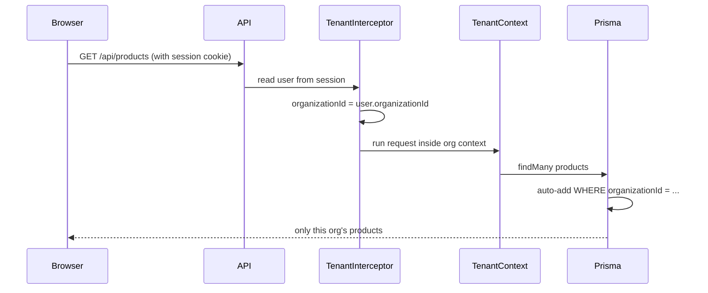

# Multitenant Implementation — Overview

This document explains the multitenant SaaS implementation: what was built, why, and how the pieces fit together. It complements [`MULTITENANT_DESIGN.md`](./MULTITENANT_DESIGN.md), which is the original design and implementation plan.

---

## Table of contents

1. [What multitenant means in this app](#1-what-multitenant-means-in-this-app)
2. [Roles and access model](#2-roles-and-access-model)
3. [Step 1 — Database: Organization and organizationId](#3-step-1--database-organization-and-organizationid)
4. [Step 2 — How we know which org a request belongs to](#4-step-2--how-we-know-which-org-a-request-belongs-to)
5. [Step 3 — Backend data isolation](#5-step-3--backend-data-isolation)
6. [Step 4 — Authentication changes](#6-step-4--authentication-changes)
7. [Step 5 — Organizations module (super admin)](#7-step-5--organizations-module-super-admin)
8. [Step 6 — The hasStores flag (two org modes)](#8-step-6--the-hasstores-flag-two-org-modes)
9. [Step 7 — Service-level fixes](#9-step-7--service-level-fixes)
10. [Step 8 — Frontend changes](#10-step-8--frontend-changes)
11. [Step 9 — Bug fixes along the way](#11-step-9--bug-fixes-along-the-way)
12. [End-to-end examples](#12-end-to-end-examples)
13. [What was intentionally not changed](#13-what-was-intentionally-not-changed)
14. [Key files reference](#14-key-files-reference)
15. [One-sentence summary](#15-one-sentence-summary)

---

## 1. What multitenant means in this app

**Before:** The app behaved like a single company with stores, products, sales, and so on.

**After:** The app behaves like a **SaaS platform** where:

- Many **organizations** (tenants) share the same application and database.
- Each organization's data is **isolated** — Org A must never see Org B's products, sales, users, etc.
- A **super admin** manages the platform and all organizations.
- Each org has its own **admin** and optionally **branch managers** (store staff).

> One app, many companies, strict data walls between them.

---

## 2. Roles and access model

```
Platform level
└── super_admin          → manages all organizations (no tenant data)

Organization level (per company)
├── admin                → full control inside their org
└── branch_manager       → works in one assigned store (only if org has stores)
```

| Role | Scope | Typical UI |
|------|--------|------------|
| `super_admin` | Whole platform | `/super-admin`, organizations list |
| `admin` | One organization | Dashboard, products, users, etc. |
| `branch_manager` | One store in one org | Submit sale, my stock, sales history |

---

## 3. Step 1 — Database: Organization and organizationId

### New model: `Organization`

Each tenant is an organization with:

| Field | Purpose |
|-------|---------|
| `name` | Company name |
| `hasStores` | `true` = multi-store model; `false` = direct sales, no stores in UI |
| `isActive` | Can disable an org |

**Schema:** `api/prisma/models/organization.prisma`

### Every business table got `organizationId`

Examples: `User`, `Store`, `Product`, `Category`, `Inventory`, `Sale`, `Expense`, `AuditLog`, and others.

Every row is tagged with **which org it belongs to**.

### Migration strategy

1. Create the `organization` table.
2. Add nullable `organizationId` to all tenant tables.
3. Create a **default organization** and backfill existing data into it.
4. Make `organizationId` required (except `super_admin` users, who have no org).
5. Change unique constraints from global → **per organization**  
   - e.g. product name unique per org, not globally  
   - Same pattern for expense categories and product categories

**Migration:** `api/prisma/migrations/20260619000000_add_multitenant_organization/`

Additional migrations:

| Migration | Purpose |
|-----------|---------|
| `20260619110000_product_unique_per_organization` | Product name uniqueness per org |
| `20260619120000_add_org_warehouse_store` | Hidden warehouse store for direct-sales orgs |
| `20260619130000_expense_category_unique_per_organization` | Expense/category uniqueness per org |

### Seed

- Default organization for legacy data.
- `superadmin@platform.local` super admin user for platform management.

**File:** `api/prisma/seed.ts`

---

## 4. Step 2 — How we know which org a request belongs to

**No subdomains.** The tenant is resolved from the **logged-in user's session**:

```
User logs in → session has organizationId → every API request uses that org
```

### Request flow



**Special case:** `super_admin` has `organizationId = null` → tenant scoping is **bypassed** so they can manage all organizations.

---

## 5. Step 3 — Backend data isolation

Three layers work together.

### A. `TenantContextService` (AsyncLocalStorage)

Stores the current request's `organizationId` in memory for that request only.

**File:** `api/src/common/tenant/tenant-context.service.ts`

### B. `TenantInterceptor` (runs on every HTTP request)

1. Read the user from the session.
2. If `super_admin` → set context to `null` (no filter).
3. If a normal user → set context to their `organizationId`.
4. Run the rest of the request inside that context.

**File:** `api/src/common/tenant/tenant.interceptor.ts`

### C. Prisma Client Extension

Automatically scopes database queries for 11 tenant models.

**File:** `api/src/prisma/tenant-scoping.extension.ts`

| Behavior | Example |
|----------|---------|
| **Reads** — adds `organizationId` to `where` | `findMany` products → only this org's products |
| **Creates** — injects `organizationId` | New sale → tagged with current org |
| **`findUnique` → `findFirst`** | Prevents fetching another org's row by ID alone |

**Scoped models:** `User`, `Store`, `Category`, `Product`, `Inventory`, `Sale`, `SaleCorrection`, `StockSupply`, `ExpenseCategory`, `Expense`, `AuditLog`

**Bypass when:** the model isn't tenant-scoped, or `organizationId` is `null` / `undefined` (super admin).

### D. Raw SQL

The Prisma extension does not cover raw SQL. Report queries and inventory lock utilities were updated manually to include `organizationId` in `WHERE` clauses.

**File:** `api/src/modules/reports/reports.service.ts`, `api/src/common/utils/inventory-lock.util.ts`

---

## 6. Step 4 — Authentication changes

### Session fields

`organizationId` is stored on the user and exposed in the session via Better Auth additional fields.

**File:** `api/src/modules/auth/auth.config.ts`

### Signup validation

On user creation (`auth.hooks.ts`):

- `super_admin` — special handling.
- `admin` / `branch_manager` — must have a valid `organizationId`.
- **`branch_manager` is blocked** if the org has `hasStores = false` (no stores = no managers).

**File:** `api/src/modules/auth/auth.hooks.ts`

### `/api/me` response

Returns organization context for the frontend:

```json
{
  "user": { "..." },
  "organization": {
    "id": "...",
    "name": "Acme Retail",
    "hasStores": true
  }
}
```

**File:** `api/src/modules/auth/me.service.ts`

---

## 7. Step 5 — Organizations module (super admin)

New API under `/api/organizations` (super admin only):

- List, create, and update organizations.
- Platform stats (organization count, user count).
- On create with `hasStores = false` → auto-provision a hidden **org warehouse** store (see [Step 6](#8-step-6--the-hasstores-flag-two-org-modes)).

**Backend:** `api/src/modules/organizations/`

**Frontend:**

| Route | Purpose |
|-------|---------|
| `/super-admin` | Platform dashboard |
| `/super-admin/organizations` | Organization list |
| `/super-admin/organizations/new` | Create organization |
| `/super-admin/organizations/[id]` | Org detail and settings |

---

## 8. Step 6 — The hasStores flag (two org modes)

| `hasStores` | Meaning | Who sells? | Stock tracked how? |
|-------------|---------|------------|---------------------|
| `true` | Classic multi-store | Branch managers per store | Per store |
| `false` | Direct sales, no stores in UI | Admin submits sales | One pool per org (flat list) |

### Problem

Inventory, sales, and stock supply all require a `storeId` in the database. Organizations without stores don't have real stores.

### Solution: hidden "Organization Stock" warehouse

- A system store with `isOrgWarehouse = true`.
- Hidden from store lists and store management UI.
- All stock, supply, and sales for `hasStores = false` orgs go through this store.
- `TenantStoreResolver` selects it automatically — users don't see "stores".

Internally the model is still store-based; externally it behaves like org-level inventory.

**Files:**

- `api/src/common/tenant/tenant-store-resolver.service.ts`
- `api/src/modules/stores/stores.service.ts` (`ensureOrgWarehouse`)
- `api/src/common/utils/org-warehouse.constants.ts`

### Backend behavior (`TenantStoreResolver`)

| Feature | Direct-sales org (`hasStores = false`) |
|---------|----------------------------------------|
| Inventory list | Scoped to org warehouse |
| Stock report | Scoped to org warehouse |
| Admin submit sale | Allowed; uses org warehouse |
| Stock supply | `storeId` optional; backend resolves warehouse |

### Frontend behavior

| UI area | Change |
|---------|--------|
| Sidebar | Hides **Stores**; shows **Submit Sale** for admin |
| Stock Supply, Inventory, Stock Report | Still visible (org-level) |
| Store pickers / filters | Hidden where not needed |

---

## 9. Step 7 — Service-level fixes

The Prisma extension handles most reads and writes. Some logic needed explicit organization awareness:

| Area | Change |
|------|--------|
| **Products** | Uniqueness check + DB index per `(name, model, organizationId)` |
| **Expense categories** | Uniqueness per `(name, organizationId)`; fixed stale global index |
| **Product categories** | Same per-org uniqueness pattern |
| **Users** | Scoped to org; signup passes `organizationId` |
| **Sales** | Admin can POST sales when `hasStores = false` |
| **Stores** | Cannot create real stores in direct-sales orgs; warehouse cannot be deactivated |
| **Reports** | All aggregations filtered by `organizationId` |

### Helper utilities

| Utility | Purpose |
|---------|---------|
| `requireOrganizationId(user)` | Fail if the user has no organization |
| `withOrganizationId(data, orgId)` | Attach `organizationId` on create |

**Files:** `api/src/common/utils/require-organization-id.util.ts`, `api/src/common/utils/with-organization-id.util.ts`

---

## 10. Step 8 — Frontend changes

### Types and auth mapping

`AppUser` now includes: `organizationId`, `organizationName`, `hasStores`, and `super_admin` role.

**Files:** `web/lib/types.ts`, `web/lib/auth/map-user.ts`, `web/types/auth/me.ts`

### Route guards

**File:** `web/lib/auth/routes.ts`

| Rule | Behavior |
|------|----------|
| `super_admin` | Only `/super-admin/*` routes |
| Admin + `hasStores = false` | Can access `/submit-sale` (normally manager-only) |
| `branch_manager` | Blocked from admin-only routes |

### Dynamic sidebar

Navigation is built from role + `hasStores`:

- **Super admin:** Platform, Organizations
- **Admin with stores:** Full Stock group + Stores
- **Admin without stores:** Stock Supply, Inventory, Stock Report, Submit Sale (no Stores)

**File:** `web/components/shell/sidebar.tsx`

### Conditional UI

- Users page hides store assignment when `!hasStores`.
- Supply, inventory, and report pages hide store filters for direct-sales orgs.

---

## 11. Step 9 — Bug fixes along the way

### Product duplicate error across orgs

**Symptom:** Creating a product in Org B failed with "already exists" even though it didn't exist in that org.

**Cause:** A **global** unique index on product name remained in the database after multitenant migration.

**Fix:** Migration to drop the global index, add a per-org unique index, and an explicit org filter in `assertUniqueName`.

### Expense category same issue

**Symptom:** Creating expense category `"test"` returned 500 Internal Server Error.

**Cause:** `DROP CONSTRAINT` did not remove a **unique index** on `name` only. Org B collided with Org A's category name.

**Fix:** Migration `DROP INDEX expense_category_name_key`, enforce `(name, organizationId)`, and org-scoped check in the service.

---

## 12. End-to-end examples

### Org "Acme Retail" (`hasStores = true`)

1. Super admin creates the organization.
2. An Acme admin user is created with `organizationId`.
3. Acme admin logs in → session has Acme's `organizationId`.
4. Every API call → interceptor sets tenant context → Prisma filters by Acme.
5. Admin creates stores, products, and supplies stock to stores.
6. Branch managers sell from their assigned store.

### Org "Solo Shop" (`hasStores = false`)

1. Super admin creates the org with `hasStores = false`.
2. System creates a hidden "Organization Stock" warehouse.
3. Solo admin logs in → same tenant isolation as any org.
4. Admin adds products and supplies stock (no store picker).
5. Admin submits sales from the Submit Sale page.
6. Inventory and stock report show org-wide quantities.

### Super admin

1. Logs in with no `organizationId`.
2. Tenant scoping is bypassed for platform queries.
3. Manages organizations via `/super-admin`.
4. Cannot access normal tenant app routes (redirected to super-admin).

---

## 13. What was intentionally not changed

- **No subdomain routing** — tenant comes from the session only.
- **No separate databases per org** — single database, row-level isolation.
- **Product categories** — per-org (each org defines its own categories).
- **Expense categories** — start empty per org; admin creates via UI.
- **Design plan file** — [`MULTITENANT_DESIGN.md`](./MULTITENANT_DESIGN.md) was the reference; this overview describes what was implemented.

---

## 14. Key files reference

### Database and migrations

| Path | Purpose |
|------|---------|
| `api/prisma/models/organization.prisma` | Organization model |
| `api/prisma/migrations/20260619000000_add_multitenant_organization/` | Core multitenant migration |
| `api/prisma/seed.ts` | Super admin and default org seed |

### Tenant infrastructure

| Path | Purpose |
|------|---------|
| `api/src/common/tenant/tenant-context.service.ts` | AsyncLocalStorage org context |
| `api/src/common/tenant/tenant.interceptor.ts` | Per-request tenant resolution |
| `api/src/common/tenant/tenant-store-resolver.service.ts` | Store scope for both org modes |
| `api/src/prisma/tenant-scoping.extension.ts` | Automatic Prisma query scoping |

### Auth and organizations

| Path | Purpose |
|------|---------|
| `api/src/modules/auth/auth.config.ts` | Session org fields |
| `api/src/modules/auth/auth.hooks.ts` | Signup validation |
| `api/src/modules/auth/me.service.ts` | `/api/me` organization payload |
| `api/src/modules/organizations/` | Super admin org CRUD |

### Frontend

| Path | Purpose |
|------|---------|
| `web/lib/auth/routes.ts` | Role and route guards |
| `web/lib/auth/map-user.ts` | API user → AppUser mapping |
| `web/components/shell/sidebar.tsx` | Dynamic navigation |
| `web/app/(app)/super-admin/` | Super admin UI |

---

## 15. One-sentence summary

**Every piece of business data belongs to an organization; every request carries that org in context; the database layer automatically filters by it; super admins sit above tenants; and `hasStores` switches between multi-store and direct-sales workflows using a hidden warehouse store.**
