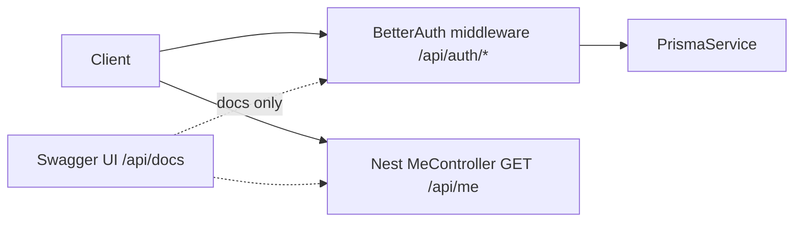

# Better-Auth + Swagger Setup Guide

Complete reference for how authentication and API documentation are configured in the Inventory API (`api/`).

This guide reflects the **current** architecture: Better-Auth owns HTTP auth routes natively; Swagger documents them without Nest proxy controllers.

---

## Table of contents

1. [Introduction](#1-introduction)
2. [Prerequisites and packages](#2-prerequisites-and-packages)
3. [Database layer (Prisma)](#3-database-layer-prisma)
4. [Better-Auth configuration](#4-better-auth-configuration)
5. [NestJS integration](#5-nestjs-integration)
6. [Hooks and business rules](#6-hooks-and-business-rules)
7. [Auth API reference](#7-auth-api-reference)
8. [Security hardening](#8-security-hardening)
9. [Swagger setup (docs-only pattern)](#9-swagger-setup-docs-only-pattern)
10. [Testing in Swagger UI](#10-testing-in-swagger-ui)
11. [Project file map](#11-project-file-map)
12. [Troubleshooting](#12-troubleshooting)
13. [Out of scope / next steps](#13-out-of-scope--next-steps)

---

## 1. Introduction

### What Better-Auth handles

Better-Auth is a self-hosted authentication library. In this project it:

- Mounts HTTP routes under `/api/auth/*` (sign-up, sign-in, sign-out, get-session)
- Hashes passwords and manages sessions in PostgreSQL via Prisma
- Sets an HTTP-only session cookie (`better-auth.session_token`)
- Enforces CSRF checks on mutating requests (requires matching `Origin` header)

### What NestJS owns

NestJS wraps Better-Auth via `@thallesp/nestjs-better-auth` and adds:

- A global `AuthGuard` (all Nest routes require a session unless marked `@AllowAnonymous()`)
- One custom auth route: `GET /api/me` (returns the session user via `@Session()`)
- Hook providers for sign-up/sign-in validation and user lifecycle rules
- Swagger UI at `/api/docs` (with manually merged auth route documentation)

### Architecture



**Key design decision:** Auth routes are **not** Nest `@Controller` handlers. They are Express middleware mounted by the Better-Auth Nest module. Swagger lists them via merged OpenAPI paths (see [Section 9](#9-swagger-setup-docs-only-pattern)).

---

## 2. Prerequisites and packages

### Runtime requirements

- Node.js 20+
- pnpm
- PostgreSQL (Neon in development)

### Key npm packages

| Package | Purpose |
|---------|---------|
| `better-auth` | Core auth library (sessions, email/password, cookies) |
| `@thallesp/nestjs-better-auth` | NestJS module, global guard, hook decorators |
| `@better-auth/cli` | Generate/update Prisma auth schema from config |
| `@nestjs/swagger` | OpenAPI document and Swagger UI |
| `class-validator` / `class-transformer` | DTO schemas (Swagger + future Nest routes) |
| `helmet` | HTTP security headers |
| `joi` | Environment variable validation at startup |
| `@prisma/client` / `prisma` | Database ORM (v6) |

### Why `bodyParser: false` in main.ts

```typescript
const app = await NestFactory.create(AppModule, { bodyParser: false });
```

Nest's built-in JSON/urlencoded parsers are disabled because `@thallesp/nestjs-better-auth` registers its own body parser middleware (required for Better-Auth route handling and optional raw body support). See `bodyParser` options in `auth.module.ts`.

---

## 3. Database layer (Prisma)

### Multi-file schema

Prisma loads all `*.prisma` files recursively from the `prisma/` folder via [`prisma.config.ts`](../prisma.config.ts):

```typescript
export default {
  schema: path.join('prisma'),
} satisfies PrismaConfig;
```

This keeps auth models in [`prisma/models/auth.prisma`](../prisma/models/auth.prisma) separate from future domain models.

### Auth models

| Model | Purpose |
|-------|---------|
| `User` | Account with extended fields (`role`, `isActive`, `storeId`) |
| `Session` | Active sessions (1-hour expiry configured in Better-Auth) |
| `Account` | Credential provider linkage (email/password hash) |
| `Verification` | Token storage for future email flows |

### Custom User fields

```prisma
enum UserRole {
  admin
  branch_manager
}

model User {
  id            String    @id
  name          String?
  email         String
  emailVerified Boolean   @default(false)
  image         String?
  createdAt     DateTime  @default(now())
  updatedAt     DateTime  @updatedAt
  role          UserRole          // required
  isActive      Boolean?
  storeId       String?           // optional; for branch_manager
  sessions      Session[]
  accounts      Account[]

  @@unique([email])
  @@map("user")
}
```

| Field | Type | Set by |
|-------|------|--------|
| `role` | `UserRole` enum | Client on dev sign-up; admin API in prod (planned) |
| `isActive` | `Boolean?` | Server only (`AuthUserDatabaseHook`) |
| `storeId` | `String?` | Client on dev sign-up for `branch_manager`; cleared for `admin` |

### Migrations

```bash
cd api
pnpm prisma:migrate    # apply migrations (dev)
pnpm prisma:generate   # regenerate Prisma client
pnpm prisma:studio     # browse data
```

### Regenerate auth schema from Better-Auth config

When you change `additionalFields` in `auth.config.ts`, regenerate the Prisma model skeleton:

```bash
cd api
npx better-auth generate \
  --config src/modules/auth/auth.config.ts \
  --output prisma/models/auth.prisma \
  --yes
```

Review the diff before committing — custom enum/types may need manual adjustment.

---

## 4. Better-Auth configuration

File: [`src/modules/auth/auth.config.ts`](../src/modules/auth/auth.config.ts)

### Factory pattern

```typescript
export function createAuth(prisma: PrismaClient) {
  return betterAuth({ /* ... */ });
}
```

The factory receives a live `PrismaClient` so the Nest module can inject the shared `PrismaService` instance (same DB connection pool as the rest of the app).

A standalone export `auth` exists for the Better-Auth CLI (`npx better-auth generate`).

### Environment variables

| Variable | Dev | Production | Purpose |
|----------|-----|------------|---------|
| `DATABASE_URL` | Required | Required | PostgreSQL connection string |
| `BETTER_AUTH_SECRET` | Optional (fallback dev secret) | Required, min 32 chars | Session signing / encryption |
| `BETTER_AUTH_URL` | Optional (defaults to `http://localhost:PORT`) | Required, valid URL | Base URL for callbacks and cookies |
| `BETTER_AUTH_TRUSTED_ORIGINS` | Optional | Required | Comma-separated CORS + CSRF origins |
| `NODE_ENV` | `development` | `production` | Controls cookie security and sign-up policy |
| `ALLOW_PUBLIC_SIGNUP` | Optional | Optional | Override prod sign-up block if `true` |
| `PORT` | Default `4000` | Default `4000` | HTTP listen port |
| `SWAGGER_ENABLED` | N/A (auto on in dev) | Set `true` to force Swagger in prod | |

Validated at startup via Joi in [`src/config/env.validation.ts`](../src/config/env.validation.ts).

Copy [`api/.env.example`](../.env.example) to `api/.env` and fill in values.

### Core options

```typescript
betterAuth({
  url: process.env.BETTER_AUTH_URL ?? `http://localhost:${process.env.PORT ?? 4000}`,
  secret: getAuthSecret(isProd),
  basePath: '/api/auth',
  trustedOrigins: parseTrustedOrigins(process.env.BETTER_AUTH_TRUSTED_ORIGINS),
  hooks: {},
  databaseHooks: {},
  database: prismaAdapter(prisma, { provider: 'postgresql' }),
  // ...
});
```

- **`basePath`** — All Better-Auth HTTP routes live under `/api/auth/*`
- **`hooks: {}` / `databaseHooks: {}`** — Empty placeholders required so Nest hook providers (`@Hook`, `@DatabaseHook`) can register
- **`trustedOrigins`** — Used for CSRF origin checks and CORS (see [Section 8](#8-security-hardening))

### Email and password

```typescript
emailAndPassword: {
  enabled: true,
  minPasswordLength: 8,
},
```

Additional password rules (uppercase + number) are enforced in `AuthSignUpHook`, not here.

### Additional user fields

```typescript
user: {
  additionalFields: {
    role:     { type: 'string', input: true,  required: true  },
    isActive: { type: 'boolean', input: false               },
    storeId:  { type: 'string', input: true,  required: false },
    name:     { type: 'string', input: true                 },
  },
},
```

| Field | `input` | Meaning |
|-------|---------|---------|
| `role` | `true` | Client may send on sign-up (dev only in practice) |
| `isActive` | `false` | Never client-writable; set by database hook |
| `storeId` | `true` | Optional on sign-up for `branch_manager` |
| `name` | `true` | Display name on sign-up |

### Session and cookies

```typescript
session: {
  expiresIn: 60 * 60,        // 1 hour
  cookieCache: {
    enabled: true,
    maxAge: 60 * 60,
  },
},
advanced: {
  useSecureCookies: isProd,
  defaultCookieAttributes: {
    httpOnly: true,
    secure: isProd,
    sameSite: 'strict',
  },
},
```

Session cookie name: **`better-auth.session_token`**

---

## 5. NestJS integration

File: [`src/modules/auth/auth.module.ts`](../src/modules/auth/auth.module.ts)

```typescript
@Module({
  imports: [
    AuthModule.forRootAsync({
      imports: [PrismaModule],
      inject: [PrismaService],
      useFactory: (prisma: PrismaService) => ({
        auth: createAuth(prisma),
        bodyParser: {
          json: { limit: '2mb' },
          urlencoded: { limit: '2mb', extended: true },
          rawBody: true,
        },
      }),
    }),
  ],
  controllers: [MeController],
  providers: [AuthSignInHook, AuthSignUpHook, AuthUserDatabaseHook],
})
export class BetterAuthNestModule {}
```

Registered in [`src/app.module.ts`](../src/app.module.ts) as `BetterAuthNestModule`.

### Global AuthGuard

`@thallesp/nestjs-better-auth` registers a global guard by default. All Nest controller routes require a valid session unless decorated with `@AllowAnonymous()`.

### MeController (only Nest auth route)

File: [`src/modules/auth/auth.controller.ts`](../src/modules/auth/auth.controller.ts)

```typescript
@Get('me')
me(@Session() session: { user: unknown }) {
  return { user: session.user };
}
```

Returns the same user object as `GET /api/auth/get-session`, but without the session metadata wrapper. Useful for frontend apps that only need the current user.

### Useful decorators

| Decorator | Purpose |
|-----------|---------|
| `@Session()` | Inject current session into a controller method |
| `@AllowAnonymous()` | Skip auth guard (public route) |
| `@Roles(['admin'])` | Role check (from library; use on future domain routes) |

---

## 6. Hooks and business rules

File: [`src/modules/auth/auth.hooks.ts`](../src/modules/auth/auth.hooks.ts)

Hooks are Nest `@Injectable()` classes using decorators from `@thallesp/nestjs-better-auth`. They run inside Better-Auth's request pipeline.

### AuthSignUpHook — `BeforeHook('/sign-up/email')`

Runs before public sign-up is processed.

| Check | Error | When |
|-------|-------|------|
| Public sign-up disabled | 403 Forbidden | Production (unless `ALLOW_PUBLIC_SIGNUP=true`) |
| Password strength | 400 Bad Request | Missing uppercase or number |
| `role` missing or invalid | 400 Bad Request | Not `admin` or `branch_manager` |
| `admin` + `storeId` | 400 Bad Request | Admins must not have a store |

### AuthSignInHook — `BeforeHook('/sign-in/email')`

| Check | Error | When |
|-------|-------|------|
| User `isActive === false` | 401 Unauthorized | Generic message (no account state leak) |

### AuthUserDatabaseHook — `BeforeCreate('user')`

Runs before a user row is inserted.

- Sets `isActive: true`
- Forces `storeId: null` when `role === admin`
- Trims `storeId` for `branch_manager`

### Dev vs production sign-up policy

| Environment | Public sign-up | Role selection |
|-------------|----------------|----------------|
| Development | Allowed | Required: `admin` or `branch_manager` |
| Production | **Blocked (403)** | N/A — users created by admin API (planned) |

Override production block only with `ALLOW_PUBLIC_SIGNUP=true` (not recommended).

### Example sign-up bodies (dev)

**Admin:**

```json
{
  "email": "admin@example.com",
  "password": "Password1",
  "name": "Admin User",
  "role": "admin"
}
```

**Branch manager:**

```json
{
  "email": "manager@example.com",
  "password": "Password1",
  "name": "Store Manager",
  "role": "branch_manager",
  "storeId": "store-abc"
}
```

---

## 7. Auth API reference

### Endpoints

| Path | Method | Auth | Handler | Notes |
|------|--------|------|---------|-------|
| `/api/auth/sign-up/email` | POST | Public (dev) | Better-Auth | 403 in production |
| `/api/auth/sign-in/email` | POST | Public | Better-Auth | Sets session cookie |
| `/api/auth/sign-out` | POST | Session | Better-Auth | Requires cookie + Origin |
| `/api/auth/get-session` | GET | Session | Better-Auth | Returns `{ session, user }` |
| `/api/me` | GET | Session | Nest | Returns `{ user }` alias |

> **Note:** The session endpoint is `/api/auth/get-session`, not `/api/auth/session`.

### curl examples

Set your origin to match `BETTER_AUTH_TRUSTED_ORIGINS` (e.g. `http://localhost:4000`).

**Sign up (admin):**

```bash
curl -i -c cookies.txt \
  -X POST http://localhost:4000/api/auth/sign-up/email \
  -H "Content-Type: application/json" \
  -H "Origin: http://localhost:4000" \
  -d '{
    "email": "admin@example.com",
    "password": "Password1",
    "name": "Admin User",
    "role": "admin"
  }'
```

**Sign in:**

```bash
curl -i -c cookies.txt -b cookies.txt \
  -X POST http://localhost:4000/api/auth/sign-in/email \
  -H "Content-Type: application/json" \
  -H "Origin: http://localhost:4000" \
  -d '{"email":"admin@example.com","password":"Password1"}'
```

**Get session:**

```bash
curl -b cookies.txt http://localhost:4000/api/auth/get-session
```

**Get current user (Nest alias):**

```bash
curl -b cookies.txt http://localhost:4000/api/me
```

**Sign out:**

```bash
curl -b cookies.txt -c cookies.txt \
  -X POST http://localhost:4000/api/auth/sign-out \
  -H "Origin: http://localhost:4000"
```

---

## 8. Security hardening

### Environment validation

[`src/config/env.validation.ts`](../src/config/env.validation.ts) validates env vars on startup via `ConfigModule.forRoot({ validationSchema })`. Production refuses to start without a strong `BETTER_AUTH_SECRET`.

### HTTP headers (helmet)

[`src/main.ts`](../src/main.ts):

```typescript
app.use(helmet());
```

Adds standard security headers (`X-Content-Type-Options`, etc.).

### CORS

```typescript
app.enableCors({
  origin: trustedOrigins,       // from BETTER_AUTH_TRUSTED_ORIGINS
  credentials: true,
  methods: ['GET', 'POST', 'PUT', 'PATCH', 'DELETE', 'OPTIONS'],
});
```

Required for browser clients sending cookies cross-origin.

### CSRF / Origin on mutations

Better-Auth requires a matching `Origin` (or `Referer`) header on `POST` requests such as sign-in and sign-out. Requests without a valid origin return:

```json
{ "message": "Missing or null Origin", "code": "MISSING_OR_NULL_ORIGIN" }
```

Browsers send `Origin` automatically. curl/Postman must set it manually.

### Swagger in production

Swagger UI is **disabled** when `NODE_ENV=production` unless `SWAGGER_ENABLED=true`.

### Password policy

Enforced in `AuthSignUpHook` (not Better-Auth defaults alone):

- Minimum 8 characters (Better-Auth)
- At least one uppercase letter
- At least one number

### Fields never client-writable

`isActive` has `input: false` in Better-Auth config — only the database hook sets it. `role` cannot be changed via sign-up in production because public sign-up is blocked entirely.

---

## 9. Swagger setup (docs-only pattern)

### Why auth routes are not auto-discovered

Nest Swagger scans `@Controller` classes. Better-Auth routes are Express middleware — they never appear in the OpenAPI document unless added manually.

We use a **docs-only merge pattern**: real HTTP handling stays in Better-Auth; Swagger gets a parallel path definition for documentation and "Try it out".

### File 1: swagger.config.ts

[`src/config/swagger.config.ts`](../src/config/swagger.config.ts)

```typescript
const document = SwaggerModule.createDocument(app, config, {
  extraModels: [SignUpDto, SignInDto],
});
document.paths = { ...document.paths, ...authSwaggerPaths };

SwaggerModule.setup('api/docs', app, document);
```

- **`DocumentBuilder`** — API title, description, version, cookie auth scheme
- **`extraModels`** — Registers DTO classes so `$ref` schemas resolve in merged paths
- **Path merge** — Spreads manually defined auth paths into the generated document
- **Cookie auth** — `better-auth.session_token` for protected route testing

### File 2: auth-swagger.paths.ts

[`src/config/auth-swagger.paths.ts`](../src/config/auth-swagger.paths.ts)

Defines OpenAPI path objects for:

- `POST /api/auth/sign-up/email`
- `POST /api/auth/sign-in/email`
- `POST /api/auth/sign-out`
- `GET /api/auth/get-session`

Request bodies reference DTOs via `getSchemaPath(SignUpDto)` / `getSchemaPath(SignInDto)`.

### File 3: DTOs (schema source)

| File | Used for |
|------|----------|
| [`dto/sign-up.dto.ts`](../src/modules/auth/dto/sign-up.dto.ts) | Sign-up request schema (`email`, `password`, `name`, `role`, `storeId?`) |
| [`dto/sign-in.dto.ts`](../src/modules/auth/dto/sign-in.dto.ts) | Sign-in request schema (`email`, `password`, `rememberMe?`) |

DTOs carry `@ApiProperty` decorators for Swagger and `class-validator` decorators for future Nest routes. **Better-Auth routes validate via hooks**, not Nest `ValidationPipe`.

### File 4: MeController (auto-discovered)

[`src/modules/auth/auth.controller.ts`](../src/modules/auth/auth.controller.ts) uses `@ApiTags`, `@ApiOperation`, `@ApiCookieAuth`, etc. Swagger picks up `GET /api/me` automatically — no manual path entry needed.

### How to document a new auth endpoint

1. Add the OpenAPI path object to [`auth-swagger.paths.ts`](../src/config/auth-swagger.paths.ts)
2. Create or extend a DTO with `@ApiProperty` fields if the endpoint has a request body
3. Register the DTO in `extraModels` in [`swagger.config.ts`](../src/config/swagger.config.ts)
4. Restart the dev server and verify at `/api/docs`

### How to document a new Nest domain endpoint

1. Create a controller with `@ApiTags`, `@ApiOperation`, etc.
2. Add `@ApiCookieAuth(SESSION_COOKIE_NAME)` on protected routes
3. Swagger discovers it automatically — no merge step needed

---

## 10. Testing in Swagger UI

1. Start the API:

   ```bash
   cd api
   pnpm start:dev
   ```

2. Open **http://localhost:4000/api/docs**

3. **Sign up or sign in** using the Auth section (`POST /api/auth/sign-up/email` or `POST /api/auth/sign-in/email`)

   - Browsers send `Origin` automatically when using Swagger UI from the same host
   - Sign-up requires `role` in the request body

4. Copy the `better-auth.session_token` cookie value from the response headers (or browser DevTools → Application → Cookies)

5. Click **Authorize** in Swagger UI and paste the cookie value

6. Call protected routes: `GET /api/auth/get-session` or `GET /api/me`

---

## 11. Project file map

| Path | Purpose |
|------|---------|
| `src/modules/auth/auth.config.ts` | Better-Auth instance factory |
| `src/modules/auth/auth.module.ts` | Nest module wiring |
| `src/modules/auth/auth.controller.ts` | `GET /api/me` |
| `src/modules/auth/auth.hooks.ts` | Sign-up/sign-in/database hooks |
| `src/modules/auth/auth.constants.ts` | Cookie name, roles, trusted origins helpers |
| `src/modules/auth/dto/sign-up.dto.ts` | Sign-up Swagger schema |
| `src/modules/auth/dto/sign-in.dto.ts` | Sign-in Swagger schema |
| `src/modules/auth/validators/password-strength.validator.ts` | Password rule helper |
| `src/config/swagger.config.ts` | Swagger bootstrap + path merge |
| `src/config/auth-swagger.paths.ts` | Manual OpenAPI paths for Better-Auth routes |
| `src/config/env.validation.ts` | Joi env schema |
| `src/main.ts` | App bootstrap (helmet, CORS, ValidationPipe, Swagger) |
| `prisma/models/auth.prisma` | User, Session, Account, Verification models |
| `prisma.config.ts` | Multi-file Prisma schema loader |
| `.env.example` | Environment variable template |

---

## 12. Troubleshooting

### `EPERM` on `prisma generate` (Windows)

Another Node process holds the Prisma query engine DLL. Stop all Node processes and retry:

```bash
# Windows: stop dev servers, then
pnpm prisma:generate
```

### `MISSING_OR_NULL_ORIGIN` on sign-in or sign-out

Add an `Origin` header matching `BETTER_AUTH_TRUSTED_ORIGINS`:

```bash
-H "Origin: http://localhost:4000"
```

### Sign-up returns 403 in production

Expected. Public sign-up is disabled in production. Users will be created via a future admin `POST /api/users` endpoint.

### Sign-up returns 400 for role

`role` is required and must be `admin` or `branch_manager`. Admins cannot include `storeId`.

### Neon migration fails with pooled URL

Use Neon's **direct** (non-pooled) connection URL for `prisma migrate`. Runtime can use the pooled URL. Ensure `sslmode=require` is set; avoid `channel_binding=require` (breaks Prisma).

### Auth routes return 404

Confirm the server log shows:

```
AuthModule initialized BetterAuth on '/api/auth'
```

If the base path was changed, update client requests and Swagger path definitions to match.

### Swagger missing auth routes

Verify `setupSwagger(app)` runs in `main.ts` and `document.paths = { ...document.paths, ...authSwaggerPaths }` is present in `swagger.config.ts`.

---

## 13. Out of scope / next steps

| Item | Status |
|------|--------|
| Admin `POST /api/users` for production user creation | Planned |
| `createdBy` audit field on User | Planned |
| `storeId` FK validation against `stores` table | Blocked until stores module exists |
| Rate limiting (5 req / 15 min) | Deferred to infra/reverse proxy |
| `RolesGuard` / `StoreScopeGuard` on domain routes | Planned with domain modules |
| Password reset flow | Needs email provider |
| Rename `@@map("user")` to `users` | Deferred |

---

## Quick start checklist

- [ ] Copy `api/.env.example` → `api/.env` and set `DATABASE_URL`
- [ ] Set `BETTER_AUTH_TRUSTED_ORIGINS=http://localhost:4000` (match your frontend origin)
- [ ] Run `pnpm install && pnpm prisma:migrate && pnpm start:dev`
- [ ] Open `http://localhost:4000/api/docs`
- [ ] Sign up in dev with `role: "admin"` or `role: "branch_manager"`
- [ ] Authorize Swagger with the session cookie and call `GET /api/me`
