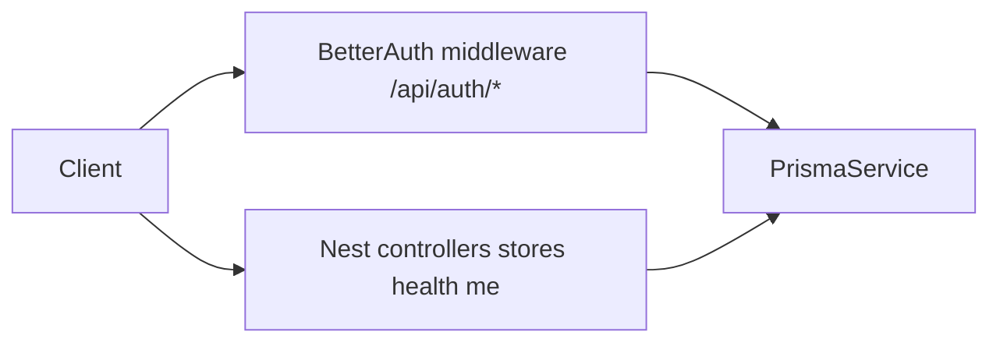

# Better-Auth Setup Guide

Complete reference for how authentication is configured in the Inventory API (`api/`).

This guide reflects the **current** architecture: Better-Auth owns HTTP auth routes natively; domain routes are tested with Postman (or curl).

---

## Table of contents

1. [Introduction](#1-introduction)
2. [Prerequisites and packages](#2-prerequisites-and-packages)
3. [Database layer (Prisma)](#3-database-layer-prisma)
4. [Better-Auth configuration](#4-better-auth-configuration)
5. [NestJS integration](#5-nestjs-integration)
6. [Hooks and business rules](#6-hooks-and-business-rules)
7. [Auth API reference](#7-auth-api-reference)
8. [Security hardening](#8-security-hardening)
9. [Testing with Postman](#9-testing-with-postman)
10. [Project file map](#10-project-file-map)
11. [Troubleshooting](#11-troubleshooting)
12. [Out of scope / next steps](#12-out-of-scope--next-steps)

---

## 1. Introduction

### What Better-Auth handles

Better-Auth is a self-hosted authentication library. In this project it:

- Mounts HTTP routes under `/api/auth/*` (sign-up, sign-in, sign-out, get-session)
- Hashes passwords and manages sessions in PostgreSQL via Prisma
- Sets an HTTP-only session cookie (`better-auth.session_token`)
- Enforces CSRF checks on mutating requests (requires matching `Origin` header)

### What NestJS owns

NestJS wraps Better-Auth via `@thallesp/nestjs-better-auth` and adds:

- A global `AuthGuard` (all Nest routes require a session unless marked `@AllowAnonymous()`)
- One custom auth route: `GET /api/me` (returns the session user via `@Session()`)
- Hook providers for sign-up/sign-in validation and user lifecycle rules
- `@Roles()` enforcement via the same global AuthGuard

### Architecture



**Key design decision:** Auth routes are **not** Nest `@Controller` handlers. They are Express middleware mounted by the Better-Auth Nest module.

---

## 2. Prerequisites and packages

### Runtime requirements

- Node.js 20+
- pnpm
- PostgreSQL (Neon in development)

### Key npm packages

| Package | Purpose |
|---------|---------|
| `better-auth` | Core auth library (sessions, email/password, cookies) |
| `@thallesp/nestjs-better-auth` | NestJS module, global guard, hook decorators |
| `@better-auth/cli` | Generate/update Prisma auth schema from config |
| `class-validator` / `class-transformer` | Request validation on Nest domain routes |
| `helmet` | HTTP security headers |
| `joi` | Environment variable validation at startup |
| `@prisma/client` / `prisma` | Database ORM (v6) |

### Why `bodyParser: false` in main.ts

```typescript
const app = await NestFactory.create(AppModule, { bodyParser: false });
```

Nest's built-in JSON/urlencoded parsers are disabled because `@thallesp/nestjs-better-auth` registers its own body parser middleware (required for Better-Auth route handling and optional raw body support). See `bodyParser` options in `auth.module.ts`.

---

## 3. Database layer (Prisma)

### Multi-file schema

Prisma loads all `*.prisma` files recursively from the `prisma/` folder via [`prisma.config.ts`](../prisma.config.ts).

This keeps auth models in [`prisma/models/auth.prisma`](../prisma/models/auth.prisma) separate from domain models.

### Auth models

| Model | Purpose |
|-------|---------|
| `User` | Account with extended fields (`role`, `isActive`, `storeId`) |
| `Session` | Active sessions (1-hour expiry configured in Better-Auth) |
| `Account` | Credential provider linkage (email/password hash) |
| `Verification` | Token storage for future email flows |

### Migrations

```bash
cd api
pnpm prisma:migrate    # apply migrations (dev)
pnpm prisma:generate   # regenerate Prisma client
pnpm prisma:studio     # browse data
```

---

## 4. Better-Auth configuration

File: [`src/modules/auth/auth.config.ts`](../src/modules/auth/auth.config.ts)

### Environment variables

| Variable | Dev | Production | Purpose |
|----------|-----|------------|---------|
| `DATABASE_URL` | Required | Required | PostgreSQL connection string |
| `BETTER_AUTH_SECRET` | Optional (fallback dev secret) | Required, min 32 chars | Session signing / encryption |
| `BETTER_AUTH_URL` | Optional (defaults to `http://localhost:PORT`) | Required, valid URL | Base URL for callbacks and cookies |
| `BETTER_AUTH_TRUSTED_ORIGINS` | Optional | Required | Comma-separated CORS + CSRF origins |
| `NODE_ENV` | `development` | `production` | Controls cookie security and sign-up policy |
| `ALLOW_SIGNUP` | Optional | Optional | Bootstrap sign-up without admin session (`true`); admin-only when `false` |
| `PORT` | Default `4000` | Default `4000` | HTTP listen port |

Validated at startup via Joi in [`src/config/env.validation.ts`](../src/config/env.validation.ts).

Session cookie name: **`better-auth.session_token`**

---

## 5. NestJS integration

File: [`src/modules/auth/auth.module.ts`](../src/modules/auth/auth.module.ts)

### Global AuthGuard

`@thallesp/nestjs-better-auth` registers a global guard by default. All Nest controller routes require a valid session unless decorated with `@AllowAnonymous()`.

The guard loads the session, attaches it to the request, and enforces `@Roles()` metadata when present.

### MeController (only Nest auth route)

File: [`src/modules/auth/auth.controller.ts`](../src/modules/auth/auth.controller.ts)

```typescript
@Get('me')
me(@Session() session: { user: unknown }) {
  return { user: session.user };
}
```

Returns the same user object as `GET /api/auth/get-session`, but without the session metadata wrapper.

### Useful decorators

| Decorator | Purpose |
|-----------|---------|
| `@Session()` | Inject current session into a controller method |
| `@AllowAnonymous()` | Skip auth guard (public route) |
| `@Roles(...)` | Role check via Better Auth global guard |

Use `@Roles()` from `src/common/decorators/roles.decorator.ts` — it sets the `"ROLES"` metadata key the AuthGuard reads.

---

## 6. Hooks and business rules

File: [`src/modules/auth/auth.hooks.ts`](../src/modules/auth/auth.hooks.ts)

### Sign-up policy (`ALLOW_SIGNUP`)

| `ALLOW_SIGNUP` | Who can call `POST /api/auth/sign-up/email` |
|----------------|---------------------------------------------|
| `true` | **Bootstrap mode** — no session required (use briefly in prod to create the first admin) |
| `false` | **Admin-only** — caller must be signed in as `admin` |
| Unset | Development: bootstrap allowed; production: admin-only |

`emailAndPassword.autoSignIn` is **`false`** — creating a user does not replace the admin’s session cookie.

After sign-up succeeds, a `USER_CREATED` audit log is written (actor = admin when admin-only; actor = new user during bootstrap).

### Example sign-up bodies

**Admin user:**

```json
{
  "email": "admin@example.com",
  "password": "Password1!",
  "name": "Admin User",
  "role": "admin"
}
```

**Branch manager:**

```json
{
  "email": "manager@example.com",
  "password": "Password1!",
  "name": "Store Manager",
  "role": "branch_manager",
  "storeId": "store-cuid"
}
```

**Production bootstrap (first admin only):**

1. Set `ALLOW_SIGNUP=true` in `.env`
2. `POST /api/auth/sign-up/email` with the admin body above (no session cookie)
3. Set `ALLOW_SIGNUP=false` and restart
4. Sign in as the new admin; create other users with the admin session cookie on sign-up

### Admin creating users (normal operation)

1. Sign in as admin (`POST /api/auth/sign-in/email`)
2. `POST /api/auth/sign-up/email` with the same `Origin` header **and** the admin session cookie
3. List/manage users via `GET/PATCH /api/users/*`

---

## 7. Auth API reference

### Endpoints

| Path | Method | Auth | Handler | Notes |
|------|--------|------|---------|-------|
| `/api/auth/sign-up/email` | POST | Bootstrap or admin session | Better-Auth | See [sign-up policy](#sign-up-policy-allow_signup) |
| `/api/auth/sign-in/email` | POST | Public | Better-Auth | Sets session cookie |
| `/api/auth/sign-out` | POST | Session | Better-Auth | Requires cookie + Origin |
| `/api/auth/get-session` | GET | Session | Better-Auth | Returns `{ session, user }` |
| `/api/me` | GET | Session | Nest | Returns `{ user }` alias |

### curl examples

**Sign in:**

```bash
curl -i -c cookies.txt -b cookies.txt \
  -X POST http://localhost:4000/api/auth/sign-in/email \
  -H "Content-Type: application/json" \
  -H "Origin: http://localhost:4000" \
  -d '{"email":"admin@example.com","password":"Password1"}'
```

**Get current user (Nest alias):**

```bash
curl -b cookies.txt http://localhost:4000/api/me
```

---

## 8. Security hardening

### CSRF / Origin on mutations

Better-Auth requires a matching `Origin` (or `Referer`) header on `POST` requests such as sign-in and sign-out. curl and Postman must set it manually:

```
Origin: http://localhost:4000
```

### Password policy

Enforced in `AuthSignUpHook`:

- Minimum 8 characters (Better-Auth)
- At least one uppercase letter
- At least one number

---

## 9. Testing with Postman

1. Start the API: `cd api && pnpm start:dev`
2. Create a request: `POST http://localhost:4000/api/auth/sign-in/email`
   - Header: `Content-Type: application/json`
   - Header: `Origin: http://localhost:4000`
   - Body (raw JSON): `{ "email": "...", "password": "..." }`
3. Postman stores the `better-auth.session_token` cookie from the response
4. Call protected routes (e.g. `GET /api/me`, `GET /stores`) — the cookie is sent automatically for the same host

For sign-up in dev, include `role` (`admin` or `branch_manager`) and optional `storeId` for managers.

---

## 10. Project file map

| Path | Purpose |
|------|---------|
| `src/modules/auth/auth.config.ts` | Better-Auth instance factory |
| `src/modules/auth/auth.module.ts` | Nest module wiring |
| `src/modules/auth/auth.controller.ts` | `GET /api/me` |
| `src/modules/auth/auth.hooks.ts` | Sign-up/sign-in/database hooks |
| `src/modules/auth/auth.constants.ts` | Cookie name, roles, trusted origins helpers |
| `src/modules/auth/validators/password-strength.validator.ts` | Password rule helper |
| `src/config/env.validation.ts` | Joi env schema |
| `src/main.ts` | App bootstrap (helmet, CORS, ValidationPipe) |
| `prisma/models/auth.prisma` | User, Session, Account, Verification models |

---

## 11. Troubleshooting

### `MISSING_OR_NULL_ORIGIN` on sign-in or sign-out

Add an `Origin` header matching `BETTER_AUTH_TRUSTED_ORIGINS`:

```bash
-H "Origin: http://localhost:4000"
```

### Sign-up returns 403

- **`ALLOW_SIGNUP=false`** (or unset in production): sign-up requires an **admin session cookie** on the request.
- Confirm the `Origin` header matches `BETTER_AUTH_TRUSTED_ORIGINS`.

### Auth routes return 404

Confirm the server log shows:

```
AuthModule initialized BetterAuth on '/api/auth'
```

---

## 12. Out of scope / next steps

| Item | Status |
|------|--------|
| User creation | **Done** — `POST /api/auth/sign-up/email` (admin-only or bootstrap via `ALLOW_SIGNUP`) |
| User list / update / deactivate | **Done** — `/api/users` |
| `StoreScopeGuard` on domain routes | Planned with domain modules |
| Password reset flow | Needs email provider |

---

## Quick start checklist

- [ ] Copy `api/.env.example` → `api/.env` and set `DATABASE_URL`
- [ ] Set `BETTER_AUTH_TRUSTED_ORIGINS=http://localhost:4000`
- [ ] Run `pnpm install && pnpm prisma:migrate && pnpm start:dev`
- [ ] Sign in via Postman with `Origin` header and session cookie
- [ ] Call `GET /api/me` to verify auth
