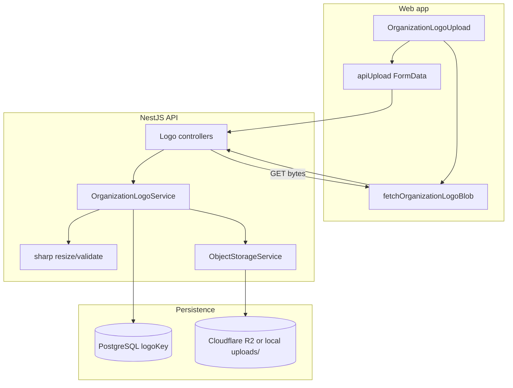

# Image upload architecture

How this project handles file uploads to object storage. Use this as the reference when adding new image features (product photos, user avatars, report assets, etc.).

For Cloudflare R2 bucket setup and env vars, see [r2-object-storage.md](./r2-object-storage.md).

---

## Table of contents

1. [Design principles](#1-design-principles)
2. [Architecture overview](#2-architecture-overview)
3. [Storage layer (`ObjectStorageService`)](#3-storage-layer-objectstorageservice)
4. [Domain layer (`OrganizationLogoService`)](#4-domain-layer-organizationlogoservice)
5. [Database pattern](#5-database-pattern)
6. [API layer](#6-api-layer)
7. [Frontend layer](#7-frontend-layer)
8. [End-to-end flows](#8-end-to-end-flows)
9. [Security model](#9-security-model)
10. [Adding a new image upload feature](#10-adding-a-new-image-upload-feature)
11. [Checklist for new uploads](#11-checklist-for-new-uploads)
12. [Related code](#12-related-code)

---

## 1. Design principles

| Principle | What we do |
|-----------|------------|
| **Private bucket** | Images live in R2 (or local `uploads/` in dev). They are **not** public URLs. |
| **API proxy** | The browser never talks to R2 directly. Authenticated API routes upload and download bytes. |
| **Object key in DB** | Store the storage path (`logoKey`), not a full URL. Lets you change bucket/provider without migrating URLs. |
| **Process on server** | Validate MIME type, size, and dimensions; resize/compress with **sharp** before storing. |
| **Memory uploads** | Multer uses `memoryStorage()` so sharp can read `file.buffer` directly. |
| **Replace = delete old** | When the file extension or path changes, delete the previous object key first. |
| **Cache busting** | `logoUpdatedAt` (or similar) is returned to the client and appended as `?v=` on preview fetches. |

---

## 2. Architecture overview



**Layers:**

1. **Frontend** — file picker → `FormData` POST; preview via credentialed GET → blob URL.
2. **Controller** — auth, role guard, Multer `FileInterceptor`, HTTP response headers.
3. **Domain service** — business rules, image processing, DB updates, orchestration.
4. **Object storage** — provider-agnostic `putObject` / `getObject` / `deleteObject`.

---

## 3. Storage layer (`ObjectStorageService`)

**File:** [`src/common/storage/object-storage.service.ts`](../src/common/storage/object-storage.service.ts)

Low-level S3-compatible client. Domain services should depend on this, not on `@aws-sdk` directly.

### Backend selection

All five env vars must be set to use R2:

- `R2_ACCOUNT_ID`
- `R2_ACCESS_KEY_ID`
- `R2_SECRET_ACCESS_KEY`
- `R2_BUCKET`
- `R2_ENDPOINT` — account S3 API URL **only** (not `.../inventory-images`)

If **any** is missing, the service falls back to the local filesystem. If `R2_ENDPOINT` incorrectly includes the bucket name as a path, objects are stored under an extra `inventory-images/` folder inside the bucket (see [r2-object-storage.md](./r2-object-storage.md)).

```
{STORAGE_LOCAL_PATH or api/uploads}/{objectKey}
```

`uploads/` is gitignored. Use R2 in production so files survive redeploys.

### Public API

```typescript
putObject(key: string, body: Buffer, contentType: string): Promise<void>
getObject(key: string): Promise<StoredObject | null>
deleteObject(key: string): Promise<void>
isLocalFallback(): boolean  // useful for logging/debug
```

### Object key conventions

Keys are POSIX-style paths inside the bucket (no leading slash):

| Feature | Key pattern | Example |
|---------|-------------|---------|
| Organization logo | `org-logos/{organizationId}/logo.{jpg\|png}` | `org-logos/cmql376mg0000l2681g9x2zmy/logo.jpg` |

Define prefixes and key builders in a `*.constants.ts` file next to the domain service so paths stay consistent.

**Suggested prefixes for future features:**

| Feature | Suggested prefix |
|---------|------------------|
| Product image | `product-images/{organizationId}/{productId}/` |
| User avatar | `user-avatars/{userId}/` |
| Report temp assets | `report-assets/{organizationId}/{reportId}/` |

---

## 4. Domain layer (`OrganizationLogoService`)

**Files:**

- [`src/common/storage/organization-logo.service.ts`](../src/common/storage/organization-logo.service.ts)
- [`src/common/storage/organization-logo.constants.ts`](../src/common/storage/organization-logo.constants.ts)

This is the **template** for any new image type. Responsibilities:

### Authorization

`assertCanManageLogo(user, organizationId)`:

- `super_admin` — any organization
- `admin` — only their own `user.organizationId`
- everyone else — `403 Forbidden`

### Upload pipeline (`uploadLogo`)

1. Check permissions.
2. Load entity from DB (need current `logoKey` for cleanup).
3. **`processUpload(file)`** — validate and transform:
   - Required buffer, max **3 MB**
   - MIME: `image/jpeg` or `image/png` only
   - Min dimensions: **200×80** px
   - Resize: max **1200×400**, `fit: inside`, `withoutEnlargement: true`
   - Re-encode: PNG (`compressionLevel: 9`) or JPEG (`quality: 88`)
4. Build object key via `organizationLogoObjectKey(orgId, extension)`.
5. If old `logoKey` exists and differs (e.g. jpg → png), `deleteObject(oldKey)`.
6. `putObject(key, buffer, contentType)`.
7. Update DB: `logoKey`, `logoUpdatedAt: new Date()`.

### Delete pipeline (`deleteLogo`)

1. Check permissions.
2. If `logoKey` set → `deleteObject`, then null out DB fields.

### Read pipelines

| Method | Use case |
|--------|----------|
| `getLogoObject(orgId, user)` | HTTP GET — checks auth, returns bytes + content type |
| `getLogoBytesByOrganizationId(orgId)` | **Internal** — PDF export, no user context; returns `null` if missing |

### Validation constants

```typescript
ORGANIZATION_LOGO_MAX_BYTES = 3 * 1024 * 1024
ORGANIZATION_LOGO_MAX_WIDTH = 1200
ORGANIZATION_LOGO_MAX_HEIGHT = 400
ORGANIZATION_LOGO_MIN_WIDTH = 200
ORGANIZATION_LOGO_MIN_HEIGHT = 80
```

Keep Multer `limits.fileSize` in sync with the domain constant.

---

## 5. Database pattern

**Model:** [`prisma/models/organization.prisma`](../prisma/models/organization.prisma)

```prisma
logoKey       String?
logoUpdatedAt DateTime?
```

| Field | Purpose |
|-------|---------|
| `logoKey` | Object path in R2/local storage. `null` = no logo. |
| `logoUpdatedAt` | Bumped on every successful upload/delete. Frontend uses it as cache-buster (`?v=...`). |

**Do not** store:

- Public CDN URLs
- Base64 in the database
- Presigned URLs (they expire)

For a new entity, add analogous fields or a small `attachments` table if you need many images per record.

---

## 6. API layer

### Module wiring

[`StorageModule`](../src/common/storage/storage.module.ts) is `@Global()` and exports `ObjectStorageService` + `OrganizationLogoService`.

### Multer pattern

Every upload endpoint uses the same interceptor setup:

```typescript
@UseInterceptors(
  FileInterceptor("logo", {          // form field name
    storage: memoryStorage(),        // required for sharp
    limits: { fileSize: ORGANIZATION_LOGO_MAX_BYTES },
  }),
)
uploadLogo(@UploadedFile() file: Express.Multer.File) { ... }
```

The form field name (`logo`) must match what the frontend appends to `FormData`.

### Endpoints (organization logo)

| Role | Method | Path | Action |
|------|--------|------|--------|
| `super_admin` | `POST` | `/api/organizations/:id/logo` | Upload/replace |
| `super_admin` | `DELETE` | `/api/organizations/:id/logo` | Remove |
| `super_admin` | `GET` | `/api/organizations/:id/logo` | Download bytes |
| `admin` | `POST` | `/api/organization/logo` | Upload own org |
| `admin` | `DELETE` | `/api/organization/logo` | Remove own org |
| `admin` | `GET` | `/api/organization/logo` | Download own org |

**Controllers:**

- [`organizations-logo.controller.ts`](../src/modules/organizations/organizations-logo.controller.ts) — super admin, `:id` in path
- [`organization-branding.controller.ts`](../src/modules/organization-branding/organization-branding.controller.ts) — org admin, org from JWT

### GET response headers

```typescript
res.setHeader("Content-Type", object.contentType);
res.setHeader("Cache-Control", "private, max-age=300");
res.send(object.body);
```

`private` — only the authenticated user's browser should cache this, not shared CDNs.

### Error responses

Validation failures return `400` with messages such as:

- `Logo must be 3MB or smaller`
- `Logo must be a PNG or JPEG image`
- `Logo must be at least 200×80 pixels`

---

## 7. Frontend layer

### Upload helper

[`web/service/upload.ts`](../../web/service/upload.ts)

```typescript
const formData = new FormData();
formData.append("logo", file);  // field name matches FileInterceptor
await apiUpload("/api/organizations/{id}/logo", formData);
```

`apiUpload` / `apiDelete` use `credentials: "include"` for session cookies.

### API wrappers

[`web/service/organizations/logo.ts`](../../web/service/organizations/logo.ts) — thin functions per scope (super admin vs current org).

### Preview (private images)

Because the bucket is private, `` does not work. Instead:

1. `GET /api/.../logo?v={logoUpdatedAt}` with credentials
2. `res.blob()` → `URL.createObjectURL(blob)`
3. Revoke object URL on unmount / when `logoUpdatedAt` changes

[`fetchOrganizationLogoBlob`](../../web/service/upload.ts) and [`organizationLogoUrl`](../../web/service/upload.ts) implement this.

### Reusable UI

[`web/components/organization/organization-logo-upload.tsx`](../../web/components/organization/organization-logo-upload.tsx)

Props inject scope-specific `uploadLogo` / `deleteLogo` callbacks so one component serves super admin and org admin pages.

**Used on:**

- Super admin org detail — [`web/app/(app)/super-admin/organizations/[id]/page.tsx`](../../web/app/(app)/super-admin/organizations/[id]/page.tsx)
- Org admin settings — [`web/app/(app)/settings/organization/page.tsx`](../../web/app/(app)/settings/organization/page.tsx)
- Super admin create org — logo uploaded **after** org is created ([`new/page.tsx`](../../web/app/(app)/super-admin/organizations/new/page.tsx)) because `organizationId` is required for the object key

### Auth / me payload

[`me.service.ts`](../src/modules/auth/me.service.ts) includes `logoKey` and `logoUpdatedAt` on the organization object so the UI knows whether to show a preview.

---

## 8. End-to-end flows

### Upload

```
User picks file
  → FormData("logo", file)
  → POST /api/.../logo (cookie auth)
  → Multer → buffer in memory
  → sharp validate + resize
  → delete old logoKey (if any)
  → putObject to R2
  → UPDATE organization SET logoKey, logoUpdatedAt
  → JSON organization response
  → UI refetches / invalidates; preview uses new logoUpdatedAt
```

### Preview

```
hasLogo && logoUpdatedAt
  → GET /api/.../logo?v={logoUpdatedAt} (credentials)
  → API getLogoObject → getObject(logoKey)
  → blob → object URL → 
```

### Delete

```
DELETE /api/.../logo
  → purgeLogoStorage (DB key + jpg/png variants)
  → deleteObject each key in R2 (and legacy bucket-prefixed paths)
  → logoKey = null, logoUpdatedAt = null
  → UI clears preview
```

### Future: PDF export (server-side read)

```
OrganizationLogoService.getLogoBytesByOrganizationId(orgId)
  → getObject(logoKey) — no HTTP, no user check
  → embed buffer in pdfmake document
```

---

## 9. Security model

| Concern | Mitigation |
|---------|------------|
| Unauthenticated access | All logo routes behind session auth + `@Roles()` |
| Cross-tenant access | Org admins scoped to `user.organizationId`; super admin only on `:id` routes |
| Direct bucket exposure | Bucket stays private; no public R2 dev URL |
| Credential leakage | R2 keys only in `api/.env`, never in frontend |
| Oversized uploads | Multer `limits` + domain validation |
| Malicious files | MIME check + sharp parse (invalid images rejected) |
| MIME sniffing attacks | Trust declared MIME for format choice; sharp re-encodes output |

---

## 10. Adding a new image upload feature

Follow the organization logo pattern. Example: **product image**.

### Step 1 — Constants

Create `product-image.constants.ts`:

```typescript
export const PRODUCT_IMAGE_MAX_BYTES = 2 * 1024 * 1024;
export const PRODUCT_IMAGE_PREFIX = "product-images";

export function productImageObjectKey(
  organizationId: string,
  productId: string,
  extension: "jpg" | "png" | "webp",
): string {
  return `${PRODUCT_IMAGE_PREFIX}/${organizationId}/${productId}/main.${extension}`;
}
```

### Step 2 — Domain service

Create `ProductImageService` (or extend a generic `ImageAssetService`):

- `processUpload(file)` — rules for products (maybe square, max 800×800, allow webp)
- `uploadProductImage(productId, user, file)` — tenant check, DB update, storage put
- `deleteProductImage(...)` / `getProductImageObject(...)`
- `getProductImageBytesByProductId(...)` — for exports or internal jobs

Inject `ObjectStorageService` + `PrismaService`.

### Step 3 — Database

Add fields to `Product` (or a related table):

```prisma
imageKey       String?
imageUpdatedAt DateTime?
```

Run `pnpm prisma migrate dev` locally; `pnpm prisma migrate deploy` on VPS.

### Step 4 — Controller

```typescript
@Post(":id/image")
@UseInterceptors(
  FileInterceptor("image", {
    storage: memoryStorage(),
    limits: { fileSize: PRODUCT_IMAGE_MAX_BYTES },
  }),
)
```

Register module, apply `@Roles()` and tenant guards consistent with other product routes.

### Step 5 — Frontend

1. Add `apiUpload` wrapper with `formData.append("image", file)`.
2. Add preview via credentialed GET + blob URL (or reuse a generic `ImageUpload` component).
3. Invalidate React Query keys after upload/delete.

### Step 6 — Verify

- Upload appears under expected prefix in R2 (or `api/uploads/...` locally)
- Replace changes extension → old object deleted
- Wrong role / wrong org → 403
- Oversize / wrong type → 400

---

## 11. Checklist for new uploads

- [ ] Object key helper with clear prefix (`{feature}/{tenantId}/...`)
- [ ] Constants file (max bytes, dimensions, allowed MIME types)
- [ ] Domain service with `processUpload`, auth checks, storage + DB orchestration
- [ ] Multer `memoryStorage()` + matching `limits.fileSize`
- [ ] Form field name matches `FileInterceptor("...")` and `FormData.append`
- [ ] DB stores **key** + **updatedAt**, not public URL
- [ ] Delete old object when key changes
- [ ] GET endpoint sets `Content-Type` and `Cache-Control: private`
- [ ] Frontend uses `credentials: "include"`; preview via blob URL
- [ ] Internal `getXBytesById` for server-side consumers (PDF, email)
- [ ] Migration deployed to all environments
- [ ] R2 token has write access to bucket (see [r2-object-storage.md](./r2-object-storage.md))

---

## 12. Related code

| Area | Path |
|------|------|
| Object storage (R2 / local) | [`src/common/storage/object-storage.service.ts`](../src/common/storage/object-storage.service.ts) |
| Logo domain logic | [`src/common/storage/organization-logo.service.ts`](../src/common/storage/organization-logo.service.ts) |
| Logo constants & keys | [`src/common/storage/organization-logo.constants.ts`](../src/common/storage/organization-logo.constants.ts) |
| Storage module | [`src/common/storage/storage.module.ts`](../src/common/storage/storage.module.ts) |
| Super admin logo API | [`src/modules/organizations/organizations-logo.controller.ts`](../src/modules/organizations/organizations-logo.controller.ts) |
| Org admin logo API | [`src/modules/organization-branding/organization-branding.controller.ts`](../src/modules/organization-branding/organization-branding.controller.ts) |
| R2 setup & env | [r2-object-storage.md](./r2-object-storage.md) |
| Frontend upload util | [`web/service/upload.ts`](../../web/service/upload.ts) |
| Frontend logo API | [`web/service/organizations/logo.ts`](../../web/service/organizations/logo.ts) |
| Upload UI component | [`web/components/organization/organization-logo-upload.tsx`](../../web/components/organization/organization-logo-upload.tsx) |
| DB model | [`prisma/models/organization.prisma`](../prisma/models/organization.prisma) |
| Migration | [`prisma/migrations/20260620100000_add_organization_logo/`](../prisma/migrations/20260620100000_add_organization_logo/) |
