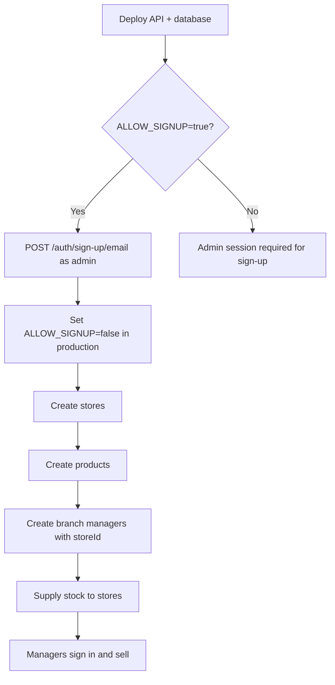
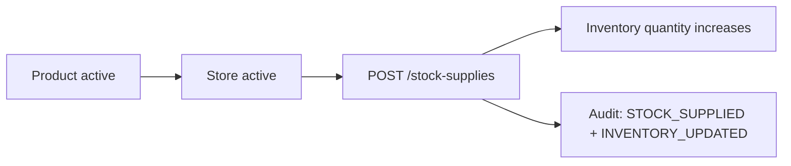
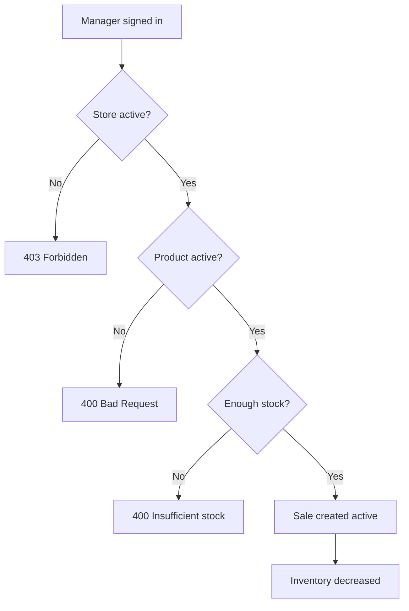
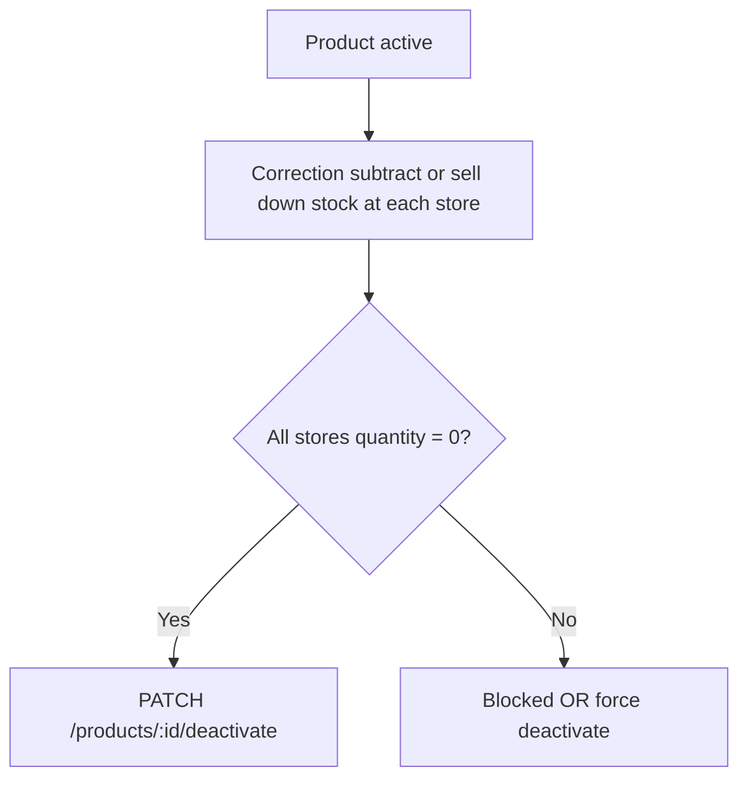

# System Behavior Guide

**Authoritative reference for how the inventory API behaves today.**

This document describes **what the system does**, **in what order**, and **what must be true before each action**. It is written for frontend developers, operators, and anyone integrating with the API.

For implementation gaps and historical audit notes, see [`business-rules.md`](./business-rules.md). For endpoint field shapes and chart mapping, see [`reports-module.md`](./reports-module.md). For NestJS patterns, see [`modules-implementation-guide.md`](./modules-implementation-guide.md).

_Last updated: 2026-06-07_

---

## Table of Contents

1. [How to use this guide](#1-how-to-use-this-guide)
2. [Core concepts](#2-core-concepts)
3. [Operational workflows](#3-operational-workflows)
4. [Action reference](#4-action-reference)
5. [Domain rules](#5-domain-rules)
6. [Reports & metrics](#6-reports--metrics)
7. [Cross-cutting behavior](#7-cross-cutting-behavior)
8. [API map](#8-api-map)
9. [Environment variables](#9-environment-variables)

---

## 1. How to use this guide

### What this document is

- A **playbook**: prerequisites, sequences, and side effects for every major operation.
- A **behavior spec**: what succeeds, what fails, and why.
- The **source of truth** for frontend validation hints, empty states, and error messaging.

### What this document is not

- Not a gap tracker or changelog (see `business-rules.md` §12–§13).
- Not a full OpenAPI schema (use list/detail endpoints and DTOs in code).
- Not the original product vision (`system-design.md` — some auth details are superseded).

### Reading conventions

| Label | Meaning |
|-------|---------|
| **Before** | Must already be true, or the API returns an error |
| **Then** | What the API does on success |
| **Blocks** | Hard failure — action cannot proceed |
| **Side effect** | Additional data changes (inventory, audit, sessions, etc.) |

---

## 2. Core concepts

### Roles

| Role | Scope | Typical user |
|------|--------|--------------|
| **admin** | Company-wide. No `storeId`. | Owner, head office |
| **branch_manager** | Exactly one store via `user.storeId`. | Store manager |

### Main entities

```
Store ──┬── Inventory (product × store quantity)
        ├── Sales (submitted by manager)
        └── Expenses (optional store link)

Product ── Category (read-only lookup)
        └── referenced by Inventory, Supply, Sales

StockSupply ── immutable history of stock movements (admin)
AuditLog ── append-only record of domain actions (admin read)
```

### Live vs historical data

| Data | Mutable? | Used for |
|------|----------|----------|
| `product.purchasePrice` / `sellingPrice` | Yes (admin) | **Current** catalog; future sales/supplies default to these |
| `inventory.quantity` | Only via supply/sale/correction | **Live** stock on hand |
| `stock_supply.unitPurchasePrice` | Never (immutable row) | **Historical** cost at receipt |
| `sale.unitPrice` / `unitPurchasePrice` | Never (immutable after create) | **Historical** revenue and COGS |

Changing product prices **does not** rewrite past sales or supply rows.

### Security defaults

- All routes require a valid session cookie (`better-auth.session_token`) except health and auth endpoints.
- Role checks via `@Roles` on controllers.
- Branch managers are scoped to their store in **services** (not a global guard).
- Rate limit: **100 requests/minute** per client.

---

## 3. Operational workflows

### 3.1 First-time setup (greenfield)



| Step | Who | Action |
|------|-----|--------|
| 1 | Operator | Run migrations; configure `APP_TIMEZONE`, `BETTER_AUTH_TRUSTED_ORIGINS` |
| 2 | Operator | Bootstrap first admin via `POST /api/auth/sign-up/email` (`role: admin`, no `storeId`) while `ALLOW_SIGNUP=true` |
| 3 | Operator | Set `ALLOW_SIGNUP=false` in production |
| 4 | Admin | `POST /stores` — create each branch |
| 5 | Admin | `POST /products` — build catalog (`sellingPrice ≥ purchasePrice`) |
| 6 | Admin | `POST /auth/sign-up/email` — create managers (`role: branch_manager`, `storeId` required, store must be **active**) |
| 7 | Admin | `POST /stock-supplies` — send stock to each store |
| 8 | Manager | `POST /auth/sign-in/email` — daily sign-in |

**Before creating a branch manager:** store must exist and be **active**.

**Before a manager can sell:** product must be **active**, store **active**, inventory row must exist with sufficient quantity (row is created on first supply).

---

### 3.2 Stocking a store (admin)



| Step | Before | Action | Then |
|------|--------|--------|------|
| 1 | Product `isActive: true` | Choose product | — |
| 2 | Store `isActive: true` | Choose store | — |
| 3 | Quantity > 0 | `POST /stock-supplies` | Supply row created; inventory increases (or row created) |
| 4 | — | Optional `unitPurchasePrice` | Defaults to product's current `purchasePrice` if omitted |

**You cannot** edit or delete a supply row. Mistakes use **correction** endpoints (§3.5).

---

### 3.3 Recording a sale (manager)



| Step | Before | Action | Then |
|------|--------|--------|------|
| 1 | User is `branch_manager`, `isActive: true` | Sign in | Session cookie issued |
| 2 | Assigned store `isActive: true` | `POST /sales` | **403** if store inactive |
| 3 | Product `isActive: true` | Select product | **400** if inactive |
| 4 | Inventory row exists at manager's store | Enter `quantitySold` > 0 | **400** if no row or qty > stock |
| 5 | `saleDate` today or ≤ 7 days ago (app timezone) | Submit | **400** if future or too old |
| 6 | — | — | Prices snapshotted from product; sale `status: active`; inventory reduced |

**Admins cannot submit sales** — only managers.

**Inactive store:** manager may still sign in and view dashboard/sales history, but **cannot** create or correct sales until the store is reactivated.

---

### 3.4 Correcting a sale (manager)

Use when quantity was wrong. **Wrong product** is a two-step process (see below).

| Step | Before | Action | Then |
|------|--------|--------|------|
| 1 | Sale belongs to manager's store | `PATCH /sales/:id/correct` | **403/404** if wrong store |
| 2 | Sale `status: active` | — | **400** if already `corrected` |
| 3 | Assigned store **active** | — | **403** if inactive |
| 4 | `correctedQuantity` ≥ 0, ≠ original `quantitySold` | Provide `reason` (required) | — |
| 5 | If corrected qty **higher** than original | — | Extra units deducted; **400** if insufficient stock |
| 6 | If corrected qty **lower** than original | — | Difference returned to inventory |
| 7 | — | — | Sale → `corrected` (one correction only); `unitPrice` unchanged; `totalAmount` recalculated |

**Wrong product workflow:**

1. Correct original sale to **quantity 0** (with reason).
2. Submit a **new sale** for the correct product.

---

### 3.5 Fixing stock mistakes (admin)

Supply rows are **immutable**. Corrections append new rows.

| Mistake | Endpoint | Input | Effect |
|---------|----------|-------|--------|
| Shipped too few | `POST /stock-supplies/corrections/add` | Positive qty, **note required** | Inventory increases |
| Shipped too many / wrong shipment | `POST /stock-supplies/corrections/subtract` | Positive qty (API stores negative), **note required** | Inventory decreases |
| Normal receipt | `POST /stock-supplies` | Positive qty, note optional | Inventory increases |

| Before correction subtract | Rule |
|----------------------------|------|
| Resulting quantity ≥ 0 | **400** if would go negative |
| Product may be **inactive** | Allowed — used to clear discontinued stock |
| Product & store for correction **add** | Must be **active** |

Optional `correctsSupplyId` must reference an existing supply for the **same product and store**.

---

### 3.6 Discontinuing a product (admin)

**Preferred path (no forced flag):**



| Step | Before | Action |
|------|--------|--------|
| 1 | — | Stop new sales (product still active until deactivated; manager can sell remaining stock) |
| 2 | For each store with stock | Sell through or `corrections/subtract` to reach 0 |
| 3 | No store has `quantity > 0` | `PATCH /products/:id/deactivate` |
| **Alternate** | Stock remains | `PATCH /products/:id/deactivate` with `{ "force": true }` — audit records remaining quantities |

**After deactivate:**

- Managers no longer see product in inventory lists or sales.
- Admins still see inactive rows with `quantity > 0` until cleared.
- Use **correction subtract** on inactive product to clear orphan stock.
- **Reactivate** only if no other active product has the same normalized name.

---

### 3.7 Closing a store (admin)

| Step | Before | Action |
|------|--------|--------|
| 1 | No **active** branch managers assigned to store | Reassign (`PATCH /users/:id`) or deactivate managers |
| 2 | No inventory with `quantity > 0` at store | Transfer/sell/correct stock to zero |
| 3 | Both above | `PATCH /stores/:id/deactivate` |

**Reactivate store:** `PATCH /stores/:id/reactivate` — name must be unique among active stores.

**Managers at deactivated store:** can sign in (read-only); cannot sell until store reactivated or they are reassigned to an active store.

---

### 3.8 Recording expenses (admin)

| Step | Before | Action |
|------|--------|--------|
| 1 | Expense category exists | `POST /expenses` |
| 2 | If `storeId` set | Store must be **active** |
| 3 | `expenseDate` | Today or past only (no future) |
| 4 | `storeId` omitted | Treated as **company-wide** expense (`null`) |

Company-wide expenses appear in company P&L but **not** in single-store filtered views.

---

### 3.9 Daily read paths

| User | Typical reads |
|------|----------------|
| Admin | Dashboard, financial summary, inventory any store, sales any store, audit log |
| Manager | Manager dashboard, own-store inventory, own-store sales, stock alerts |

**Stock alert tables** (not embedded in dashboard JSON):

- `GET /inventory/low-stock`
- `GET /inventory/out-of-stock`

Dashboard stat cards: `summary.lowStockCount`, `summary.outOfStockCount`.

---

## 4. Action reference

Quick lookup: prerequisites and outcomes per API action.

### Authentication

| Action | Who | Before | Blocks | Side effects |
|--------|-----|--------|--------|--------------|
| Sign in | Anyone | Valid email/password | Inactive user → 401 generic | Session cookie ~1 hour |
| Sign up | Bootstrap or admin | See sign-up policy below | Weak password; invalid role/store combo | User created `isActive: true`; `USER_CREATED` audit |
| Sign out | Authenticated | — | — | Session cleared |

**Sign-up policy:**

| `ALLOW_SIGNUP` | Behavior |
|----------------|----------|
| `true` | Open bootstrap (first admin in prod) |
| `false` | Requires active **admin** session |
| unset | Dev: bootstrap; Production: admin-only |

**Sign-up body rules:**

- `role`: `admin` \| `branch_manager`
- Admin: **no** `storeId`
- Manager: `storeId` **required**, store must be active
- Password: min 8 chars, uppercase, digit, special character
- Does **not** auto-sign-in the admin creating another user

---

### Users (admin)

| Action | Before | Blocks |
|--------|--------|--------|
| List / get | Admin session | — |
| Update | Target user exists | Email uniqueness; manager needs active `storeId` |
| Deactivate | Not self | All target user's sessions deleted |
| Activate | User inactive | Manager's store must be active |
| Role → admin | — | `storeId` cleared |
| Role → manager | — | `storeId` required; store active |

User creation is **only** via auth sign-up, not `POST /users`.

---

### Stores (admin)

| Action | Before | Blocks |
|--------|--------|--------|
| Create | Unique name among **active** stores | Duplicate name |
| Update | Store active (in list/get) | — |
| Deactivate | No active managers assigned; no stock > 0 | See §3.7 |
| Reactivate | Store inactive; unique active name | — |

List/get return **active** stores only.

---

### Products (admin)

| Action | Before | Blocks |
|--------|--------|--------|
| Create | Valid `categoryId`; prices > 0; `sellingPrice ≥ purchasePrice` | Name clash among active products |
| Update | Product exists | Same price/name rules on effective values |
| Deactivate | No stock > 0 unless `force: true` | See §3.6 |
| Reactivate | Product inactive; unique active name | — |

Categories: `GET /categories` only (seeded).

---

### Inventory

| Action | Who | Before | Notes |
|--------|-----|--------|-------|
| List all / by store | Admin, manager | `GET /inventory` — admin optional `?storeId=`; manager own store. `GET /inventory/stores/:storeId` — same shape | Admin sees inactive products if `quantity > 0` |
| Get one | Admin, manager | Inventory row exists | Admin: inactive product OK |
| Low-stock list | Admin, manager | — | Active product/store only; `qty > 0` and `≤ threshold` |
| Out-of-stock list | Admin, manager | — | Active product/store; `qty = 0` |
| Update threshold | Admin | Row exists | Does not change quantity; audited |

**Quantity is never PATCHed directly** — only via supply, sale, or corrections.

---

### Stock supply (admin)

| Action | Before | Blocks |
|--------|--------|--------|
| Normal supply | Active product & store; qty ≠ 0 | Inactive product/store |
| Correction add | Same as supply; note required | — |
| Correction subtract | Note required; won't go negative | Inactive product OK for clearing stock |

All run in a **transaction** with inventory locking (§7).

---

### Sales

| Action | Who | Before | Blocks |
|--------|-----|--------|--------|
| List | Admin, manager | — | Manager scoped to own store |
| Get one | Admin, manager | Sale exists; manager: own store | 404 cross-store |
| Create | Manager | Active store; active product; stock; valid date | Admin forbidden |
| Correct | Manager | Active store; sale `active`; valid qty & reason | Second correction forbidden |

---

### Expenses (admin)

| Action | Before | Blocks |
|--------|--------|--------|
| Create | Valid category; amount > 0; date not future | Inactive store if `storeId` set |
| Update | Expense exists | Same date rules |
| Delete | Expense exists | Hard delete; audited |

### Expense categories (admin)

CRUD except delete blocked when expenses still reference category.

---

### Audit log (admin)

Read-only list with filters. **No** create/update/delete via API.

---

## 5. Domain rules

### Store scoping helpers

Used in services after `@CurrentUser()` is available:

| Helper | When |
|--------|------|
| `assertStoreAccess(storeId, user)` | Path/query store must match manager's store |
| `resolveStoreFilter(user, queryStoreId?)` | List endpoints: admin optional filter; manager forced to own store |
| `requireManagerStore(user)` | Manager read paths (dashboard, sales list) — inactive store OK |
| `requireActiveManagerStore(user, findStore)` | Manager **writes** (sale create/correct) — store must be active |

### Inventory quantity rules

| Rule | Detail |
|------|--------|
| Non-negative | App checks before deduct; DB `CHECK (quantity >= 0)` |
| Locking | Advisory lock + `SELECT FOR UPDATE` on every mutation |
| Low stock | `quantity > 0` AND `quantity ≤ lowStockThreshold` |
| Out of stock | `quantity = 0` (row must exist) |
| Default threshold | **5** on new inventory rows |

### Pricing rules

| Rule | Detail |
|------|--------|
| Product create/update | `sellingPrice ≥ purchasePrice` (break-even allowed) |
| Sale | Snapshots `sellingPrice` → `unitPrice`, `purchasePrice` → `unitPurchasePrice` |
| Supply | Snapshots cost → `unitPurchasePrice` (optional override on POST) |
| Correction | Sale `unitPrice` never changes; only `quantitySold` and `totalAmount` |

### Date rules (`APP_TIMEZONE`, default `Africa/Mogadishu`)

| Field | Allowed range |
|-------|----------------|
| `saleDate` | Today back 7 days inclusive; no future |
| `expenseDate` | Today or past; no future; no max past limit |
| Report periods | Calendar boundaries in app timezone |

### Soft delete vs hard delete

| Entity | Style |
|--------|-------|
| Users, products, stores | Soft (`isActive: false`) |
| Expenses | Hard delete |
| Sales, supplies, audit | Immutable — no delete API |

### Historical integrity

- `sales.storeId` and `soldById` fixed at submission (manager reassignment does not rewrite old sales).
- Product price edits do not affect existing sales or supplies.
- Corrected sales cannot be corrected again.

---

## 6. Reports & metrics

Read-only. No export endpoints (JSON only).

### Endpoints

| Endpoint | Role |
|----------|------|
| `GET /reports/admin-dashboard` | Admin |
| `GET /reports/manager-dashboard` | Manager (auto store scope) |
| `GET /reports/financial-summary` | Admin |
| `GET /reports/product-distribution` | Admin (`categoryId` **required**) |

### Metric definitions

| Metric | Definition |
|--------|------------|
| Revenue | Sum `sale.totalAmount` for `active` + `corrected` sales in period (by `saleDate`) |
| COGS | Sum `quantitySold × unitPurchasePrice` per sale |
| Gross profit | Revenue − COGS |
| Net profit | Gross profit − expenses (in period) |
| Stock investment | Sum `supply.quantity × unitPurchasePrice` where `createdAt` in period |
| Current stock value | Sum `inventory.quantity × product.purchasePrice` today (**active** products/stores only) |
| Low stock count | Rows: active product/store, `qty > 0`, `qty ≤ threshold` |
| Out of stock count | Rows: active product/store, `qty = 0` |

Live metrics ignore dashboard date filters. Period metrics use `fromDate` / `toDate`.

**Expense scoping in reports:**

- All stores: company-wide + per-store expenses
- Single store filter: only that store's expenses (excludes company-wide)

Full response shapes: [`reports-module.md`](./reports-module.md).

---

## 7. Cross-cutting behavior

### Transactions

Sales, sale corrections, and all stock supply operations run in a **single database transaction**:

1. Lock inventory (`lockInventoryForMutation`)
2. Update inventory quantity
3. Create/update domain row(s)
4. Write audit log(s)

All commit or all roll back.

### Money

Stored as PostgreSQL `Decimal`. Aggregations use decimal-safe helpers — API returns numbers rounded to 2 decimal places.

### Auth transport

- Cookie-based Better Auth sessions (not JWT access/refresh from original design doc).
- Auth mutations need trusted `Origin` — configure `BETTER_AUTH_TRUSTED_ORIGINS` (frontend + API URLs for browser/Postman).

### Audit

Domain actions write append-only `audit_log` rows. Admin can list/filter; no API to modify audit history.

Common actions: `USER_CREATED`, `STORE_*`, `PRODUCT_*`, `STOCK_SUPPLIED`, `SALE_*`, `INVENTORY_UPDATED`, `EXPENSE_*`.

---

## 8. API map

Global prefix: `/api`. Session required unless noted.

### Auth (Better Auth)

| Method | Path | Notes |
|--------|------|-------|
| POST | `/auth/sign-in/email` | |
| POST | `/auth/sign-up/email` | User creation |
| POST | `/auth/sign-out` | |
| GET | `/me` | Current user |

### Health (anonymous)

| GET | `/health`, `/health/db` |

### Admin-only modules

| Resource | Paths |
|----------|-------|
| Users | `GET/PATCH /users`, `PATCH .../activate`, `.../deactivate` |
| Stores | `GET/POST/PATCH /stores`, `PATCH .../deactivate`, `.../reactivate` |
| Products | `GET/POST/PATCH /products`, `PATCH .../deactivate`, `.../reactivate` |
| Stock supplies | `GET/POST /stock-supplies`, `POST .../corrections/add`, `.../subtract` |
| Expenses | `GET/POST/PATCH/DELETE /expenses` |
| Expense categories | `GET/POST/PATCH/DELETE /expense-categories` |
| Audit | `GET /audit-logs` |
| Reports | `GET /reports/admin-dashboard`, `.../financial-summary`, `.../product-distribution` |

### Admin + manager

| Resource | Paths |
|----------|-------|
| Categories | `GET /categories` |
| Inventory | `GET /inventory`, `GET /inventory/stores/:storeId`, `GET .../products/:productId`, `GET /inventory/low-stock`, `GET /inventory/out-of-stock` |
| Sales | `GET/POST /sales`, `GET/PATCH /sales/:id`, `PATCH .../correct` (POST/PATCH write: **manager only**) |
| Reports | `GET /reports/manager-dashboard` (manager only) |

### Admin-only inventory write

| PATCH | `/inventory/stores/:storeId/products/:productId/threshold` |

---

## 9. Environment variables

| Variable | Effect |
|----------|--------|
| `ALLOW_SIGNUP` | Bootstrap vs admin-only user creation |
| `APP_TIMEZONE` | Sale/expense dates; report calendar boundaries |
| `BETTER_AUTH_TRUSTED_ORIGINS` | CORS + auth mutation origins (comma-separated) |
| `NODE_ENV` | With unset `ALLOW_SIGNUP`, production defaults to admin-only sign-up |
| `PORT` | API listen port (default 4000) |

See [`.env.example`](../.env.example) for full list.

---

## Related documentation

| Document | Use when |
|----------|----------|
| [`business-rules.md`](./business-rules.md) | Gap tracking, implementation audit history |
| [`reports-module.md`](./reports-module.md) | Dashboard JSON fields, charts, query params |
| [`stock-supply-design.md`](./stock-supply-design.md) | Deep dive on supply immutability and pricing |
| [`better-auth.md`](./better-auth.md) | Auth setup and trusted origins |
| [`modules-implementation-guide.md`](./modules-implementation-guide.md) | How to build new NestJS modules consistently |
